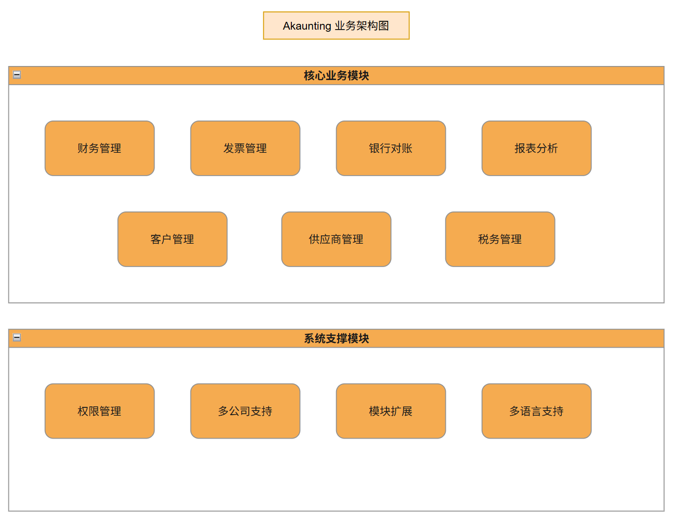

# Akaunting™

[](https://github.com/akaunting/akaunting/releases)

[](https://crowdin.com/project/akaunting)
[](https://github.com/akaunting/akaunting/actions)

专为小型企业和自由职业者设计的在线会计软件。Akaunting 采用 [Laravel](http://laravel.com), [VueJS](https://vuejs.org/), [Tailwind](https://tailwindcss.com/), RESTful API 等现代技术构建。得益于其模块化结构，Akaunting 为用户和开发者提供了强大的[应用商店](https://akaunting.com/apps)。

- [首页](https://akaunting.com) - Akaunting 之家
- [论坛](https://akaunting.com/forum) - 寻求支持
- [文档](https://akaunting.com/hc/docs) - 了解如何使用
- [开发者门户](https://developer.akaunting.com) - 产生被动收入
- [应用商店](https://akaunting.com/apps) - 扩展您的 Akaunting
- [翻译](https://crowdin.com/project/akaunting) - 帮助我们翻译 Akaunting

## 系统要求

- PHP 8.1 或更高版本
- 数据库（例如：MariaDB、MySQL、PostgreSQL、SQLite）
- Web 服务器（例如：Apache、Nginx、IIS）
- [其他库](https://akaunting.com/hc/docs/on-premise/requirements/)

## 工程结构

```
akaunting/                         # 项目根目录
├── app/                           # 核心应用程序代码
│   ├── Abstracts/                 # 抽象类定义
│   ├── Console/                   # 控制台命令
│   ├── Http/                      # HTTP 处理相关代码
│   │   ├── Controllers/           # 控制器类
│   │   ├── Middleware/            # 中间件
│   │   └── Requests/              # 表单请求验证类
│   ├── Models/                    # 数据模型
│   ├── Providers/                 # 服务提供者
│   ├── Events/                    # 事件类
│   ├── Listeners/                 # 事件监听器
│   ├── Jobs/                      # 队列任务
│   ├── Notifications/             # 通知类
│   └── ...                        # 其他应用组件
├── resources/                     # 应用资源文件
│   ├── assets/                    # 前端资源（CSS, JS等）
│   │   ├── css/                   # 样式表文件
│   │   └── js/                    # JavaScript 文件
│   ├── lang/                      # 语言包文件
│   └── views/                     # 视图模板文件
├── public/                        # 公共目录（Web服务器入口）
├── database/                      # 数据库相关文件
│   ├── migrations/                # 数据库迁移文件
│   └── seeds/                     # 数据库填充文件
├── config/                        # 配置文件
├── modules/                       # 模块目录（扩展应用）
│   ├── OfflinePayments/           # 离线支付模块
│   └── PaypalStandard/            # PayPal 标准支付模块
└── routes/                        # 路由定义文件
```

## 主要功能

Akaunting 提供了丰富的财务管理功能，各功能与系统模块对应关系如下：

| 功能 | 描述 | 对应模块/代码位置 |
|------|------|------------------|
| **发票管理** | 创建和发送专业发票，支持多种模板和自定义选项 | [app/Models/Document](file:///d%3A/Information_Technology/workspace/akaunting/app/Models/Document)、[resources/views/sales/invoices](file:///d%3A/Information_Technology/workspace/akaunting/resources/views/sales/invoices) |
| **费用跟踪** | 记录和管理业务支出，支持多种费用类型 | [app/Models/Document](file:///d%3A/Information_Technology/workspace/akaunting/app/Models/Document)、[resources/views/purchases/bills](file:///d%3A/Information_Technology/workspace/akaunting/resources/views/purchases/bills) |
| **银行对账** | 连接银行账户，自动导入交易记录并进行对账 | [app/Models/Banking](file:///d%3A/Information_Technology/workspace/akaunting/app/Models/Banking)、[resources/views/banking](file:///d%3A/Information_Technology/workspace/akaunting/resources/views/banking) |
| **财务报表** | 生成损益表、资产负债表等多种财务报告 | [app/Reports](file:///d%3A/Information_Technology/workspace/akaunting/app/Reports)、[resources/views/common/reports](file:///d%3A/Information_Technology/workspace/akaunting/resources/views/common/reports) |
| **税务管理** | 跟踪和计算各种税费，确保合规 | [app/Models/Setting/Tax](file:///d%3A/Information_Technology/workspace/akaunting/app/Models/Setting)、[resources/views/settings/taxes](file:///d%3A/Information_Technology/workspace/akaunting/resources/views/settings/taxes) |
| **多币种支持** | 支持多种货币，自动汇率转换 | [app/Models/Setting/Currency](file:///d%3A/Information_Technology/workspace/akaunting/app/Models/Setting)、[resources/views/settings/currencies](file:///d%3A/Information_Technology/workspace/akaunting/resources/views/settings/currencies) |
| **客户管理** | 维护客户信息和交易记录 | [app/Models/Common/Contact](file:///d%3A/Information_Technology/workspace/akaunting/app/Models/Common)、[resources/views/common/contacts](file:///d%3A/Information_Technology/workspace/akaunting/resources/views/common/contacts) |
| **供应商管理** | 管理供应商信息和采购记录 | [app/Models/Common/Contact](file:///d%3A/Information_Technology/workspace/akaunting/app/Models/Common)、[resources/views/common/contacts](file:///d%3A/Information_Technology/workspace/akaunting/resources/views/common/contacts) |
| **模块化扩展** | 通过应用商店扩展功能，满足特定业务需求 | [modules](file:///d%3A/Information_Technology/workspace/akaunting/modules)、[app/Utilities/Module](file:///d%3A/Information_Technology/workspace/akaunting/app/Utilities) |
| **多语言支持** | 支持多种语言界面，便于国际化使用 | [resources/lang](file:///d%3A/Information_Technology/workspace/akaunting/resources/lang)、[akaunting/laravel-language](file:///d%3A/Information_Technology/workspace/akaunting/vendor/akaunting/laravel-language) |
| **权限管理** | 灵活的用户角色和权限控制 | [app/Providers/Auth](file:///d%3A/Information_Technology/workspace/akaunting/app/Providers)、[app/Models/Auth](file:///d%3A/Information_Technology/workspace/akaunting/app/Models/Auth) |
| **数据导入导出** | 支持从其他系统导入数据，导出报表 | [app/Imports](file:///d%3A/Information_Technology/workspace/akaunting/app/Imports)、[app/Exports](file:///d%3A/Information_Technology/workspace/akaunting/app/Exports) |

## 业务架构



Akaunting 遵循模块化的业务架构设计，主要包含以下业务模块：

- **财务管理模块** - 核心模块，处理所有财务相关操作
- **发票模块** - 管理销售发票和采购账单
- **银行模块** - 处理银行账户和交易记录
- **报表模块** - 生成各种财务分析报告
- **设置模块** - 系统配置和用户管理
- **应用模块** - 支持第三方扩展应用的安装和管理

系统采用多公司支持设计，一个安装可以为多个公司提供服务，每个公司拥有独立的数据空间。

## 技术架构


Akaunting 基于现代化的技术栈构建：

- **后端框架**: [Laravel](http://laravel.com) PHP 框架，提供了强大的 MVC 架构和丰富的功能组件
- **前端框架**: [Vue.js](https://vuejs.org/) 结合 [Tailwind CSS](https://tailwindcss.com/)，实现响应式用户界面
- **数据库**: 支持 MySQL、PostgreSQL、SQLite 等主流数据库系统
- **模块系统**: 基于 Akaunting 自研的模块包，支持应用的动态安装和管理
- **API 支持**: 提供 RESTful API 接口，便于系统集成和扩展
- **缓存系统**: 集成 Redis 或 Memcached 提升系统性能
- **队列系统**: 使用 Laravel 队列处理后台任务
- **测试框架**: PHPUnit 用于单元测试，确保代码质量

前端采用模块化设计，通过 Webpack 进行打包构建，优化加载性能。

## 部署方式

### 系统要求

* PHP 8.1 or higher
* Database (e.g.: MariaDB, MySQL, PostgreSQL, SQLite)
* Web Server (eg: Apache, Nginx, IIS)
* [Other libraries](https://akaunting.com/hc/docs/on-premise/requirements/)

### 本地部署

1. 安装依赖工具：
   ```bash
   # 安装 Composer（PHP包管理器）
   # 安装 Node.js 和 NPM（前端构建工具）
   ```

2. 获取源代码：
   ```bash
   git clone https://github.com/akaunting/akaunting.git
   cd akaunting
   ```

3. 安装依赖包：
   ```bash
   composer install
   npm install
   npm run dev
   ```

4. 配置环境：
   ```bash
   cp .env.example .env
   php artisan key:generate
   ```
   
5. 配置数据库和其他设置（编辑 .env 文件）

6. 安装 Akaunting：
   ```bash
   php artisan install --db-name="akaunting" --db-username="root" --db-password="pass" --admin-email="admin@company.com" --admin-password="123456"
   ```

7. 启动服务：
   ```bash
   php artisan serve
   ```

### 生产环境部署

1. 优化前端资源：
   ```bash
   npm run production
   ```

2. 设置适当文件权限：
   ```bash
   chown -R www-data:www-data .
   chmod -R 755 .
   ```

3. 配置 Web 服务器（Apache 或 Nginx）

4. 配置计划任务：
   ```bash
   # 添加到 crontab
   * * * * * cd /path-to-your-project && php artisan schedule:run >> /dev/null 2>&1
   ```

5. 配置队列处理器（如使用队列）：
   ```bash
   php artisan queue:work
   ```

### Docker 部署（推荐）

Akaunting 也支持通过 Docker 进行容器化部署，提供了更简单的部署和维护方式。

## 框架

Akaunting 使用 [Laravel](http://laravel.com) 作为基础框架，以及 [Module](https://github.com/akaunting/module) 包来支持应用。

## 安装

* 安装 [Composer](https://getcomposer.org/download) 和 [Npm](https://nodejs.org/en/download)
* 克隆仓库：`git clone https://github.com/akaunting/akaunting.git`
* 安装依赖：`composer install ; npm install ; npm run dev`
* 安装 Akaunting：

```bash
php artisan install --db-name="akaunting" --db-username="root" --db-password="pass" --admin-email="admin@company.com" --admin-password="123456"
```

* 创建示例数据（可选）：`php artisan sample-data:seed`

## 贡献

请在提交代码时确保您的提交信息和 Pull Request 非常清晰，空的 Pull Request 信息可能会被无理由拒绝。

为 Akaunting 贡献代码时，您必须遵循 PSR 编码标准。黄金法则是：模仿现有的 Akaunting 代码。

请注意，该项目发布了[贡献者行为准则](https://akaunting.com/conduct)。*参与此项目即表示您同意遵守其条款*。

## 翻译

如果您想贡献翻译，请查看我们的 [Crowdin](https://crowdin.com/project/akaunting) 项目。

## 更新日志

请参阅 [Releases](../../releases) 了解最近更改的更多信息。

## 安全

请查看 [我们的安全政策](https://github.com/akaunting/akaunting/security/policy) 了解如何报告安全漏洞。

## 致谢

* [Denis Duliçi](https://github.com/denisdulici)
* [Cüneyt Şentürk](https://github.com/cuneytsenturk)
* [所有贡献者](../../contributors)

## 许可证

Akaunting 基于 [BSL 许可证](LICENSE.txt)发布。